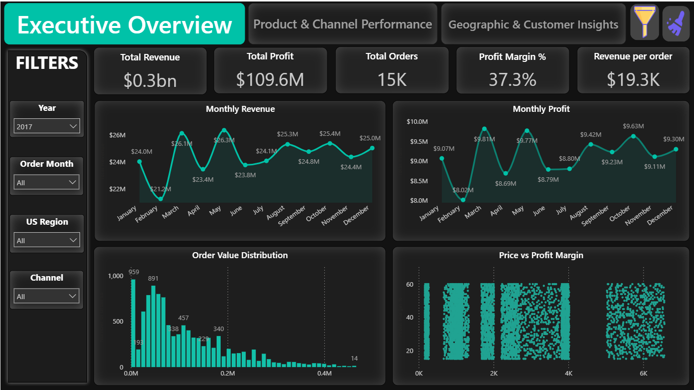
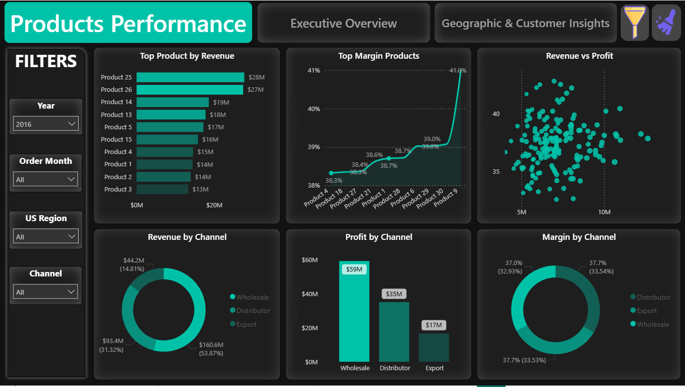
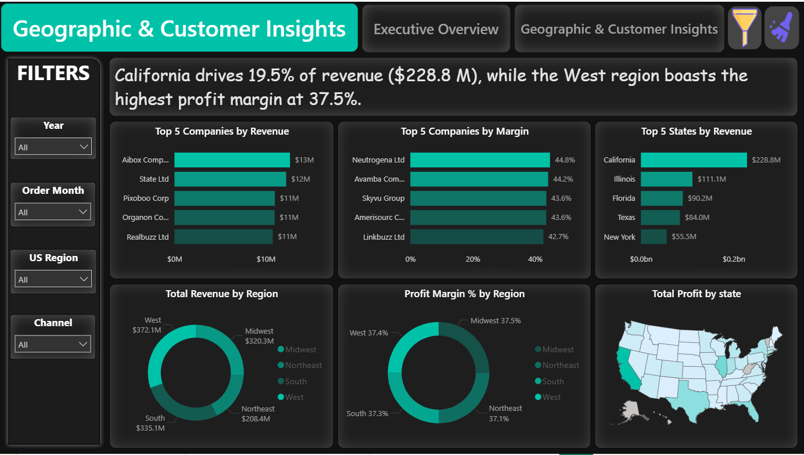
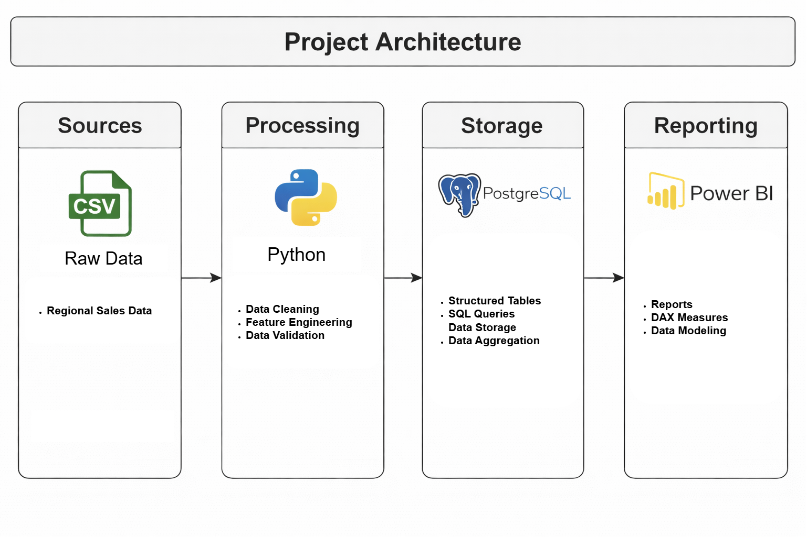

# Regional Sales — End-to-End Data Analytics

Built an **end-to-end sales analytics** solution that transforms raw **regional sales data** into **KPI-driven Dashboards** and **business-ready insights** using **Python (EDA)**, **SQL (PostgreSQL)**, and **Power BI**.

---

## Executive Summary

This project helps stakeholders answer **what is driving revenue and profit** across:
- **Regions**
- **Customers**
- **Products**
- **Time periods**

Deliverables include an interactive **Power BI report**, a structured **SQL analysis script**, a full **EDA notebook**, and a presentation for **decision-making**.

---

## Demo & Dashboard Preview
**Executive Overview**

**Product Performance**

**Geographic & Customer Insights**

### Power BI Report Demo

---

## Project Architecture (End-to-End Workflow)

**Pipeline**
1. **Raw Data (Excel)** → `Regional Sales Dataset.xlsx`  
2. **EDA / Cleaning (Python Notebook)** → `EDA_Regional_Sales_Analysis.ipynb`  
3. **Exported / Prepared Data (CSV)** → `Sales_data(EDA Exported).csv`  
4. **SQL Analysis (PostgreSQL)** → `Regional Sales Analysis.sql`  
5. **Dashboarding (Power BI)** → `Regional Sales Report.pbix`  
6. **Storytelling (Presentation)** → `Regional Sales Analysis.pptx`

---

## What’s Inside (Repository Contents)

- `EDA_Regional_Sales_Analysis.ipynb` — **Exploratory Data Analysis**, cleaning, feature understanding, and export
- `Regional Sales Analysis.sql` — SQL queries for **KPIs**, aggregations, and segment analysis
- `Regional Sales Dataset.xlsx` — original dataset (**raw**)
- `Sales_data(EDA Exported).csv` — cleaned/processed dataset (**analytics-ready**)
- `Regional Sales Report.pbix` — Power BI interactive report
- `Regional Sales Analysis.pptx` — final presentation / insights summary

---

## KPIs & Analysis(Typical Business Questions)

This project is designed to support analysis such as:
- **Revenue**, **Profit**, and **Margin** trends over time
- Performance comparison by **Region**
- Top/bottom **Products** by revenue/profit
- High-value **Customers** and customer concentration risk
- Geographic performance and distribution of sales

---

## How to Reproduce

### Option A — View Final Results (Fastest)
1. Open the Power BI file: **`Regional Sales Report.pbix`**
2. Explore report pages:
   - **Executive Overview**
   - **Geographic & Customer Insights**
   - **Product Performance**
3. Use slicers/filters to drill into **region / product / customer / time**

### Option B — Run Python EDA (Data Prep)
1. Open: `EDA_Regional_Sales_Analysis.ipynb`
2. Run all cells to:
   - inspect missing values and distributions
   - validate data quality
   - export the cleaned dataset (CSV)

### Option C — Run SQL Analysis (PostgreSQL)
1. Create a database (example: `regional_sales`)
2. Import the dataset into PostgreSQL (from Excel or CSV)
3. Run: `Regional Sales Analysis.sql`
4. Validate outputs used for KPIs and reporting

---

## Tools Used

- **Python** (EDA / preprocessing)
- **Pandas / NumPy** (data manipulation)
- **PostgreSQL + SQL** (analytics queries)
- **Power BI** (visual analytics + dashboards)
- **PowerPoint** (stakeholder presentation)

---
